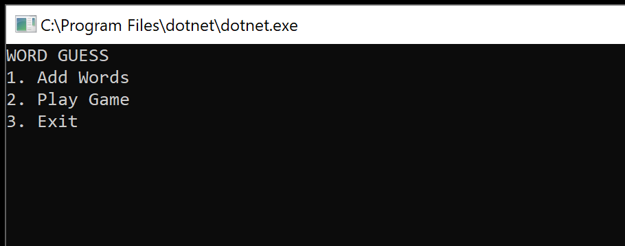
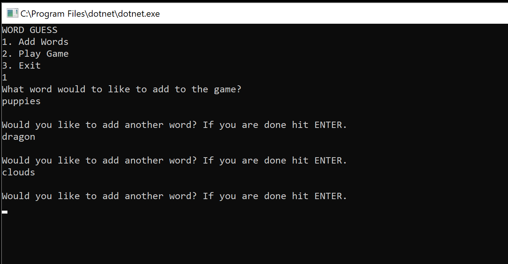
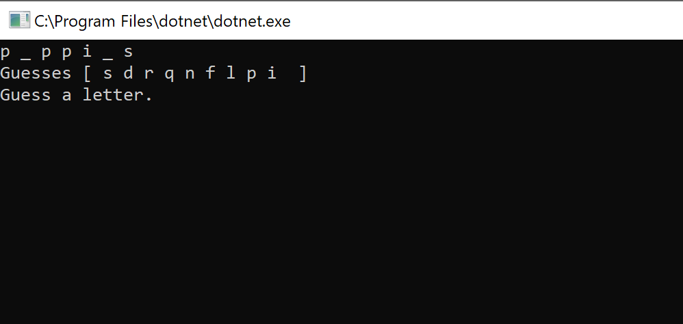

# Lab03-WordGuessGame
C# Console app where a user guess a mystery word one letter at a time. 

## Directions
Josie Cat has requested that a “Word Guess Game” be built. The main idea of the game is she must guess what a mystery word is by inputting (1) letter at a time. The game should save all of her guesses (both correct and incorrect) throughout each session of the game, along with the ability to show her how many letters out of the word she has guessed correctly.

Each time a new game session starts, the mystery word chosen should come from an external text file that randomly selects one of the words listed. This bank of words should be editable by Josie so that she may view, add, and delete words as she wishes. She expects the game to have a simple user interface that is easy to navigate.

Using everything you’ve learned up to this point, create a word guess game that will meet all of the requirements described in the user story above.

## Program Components

The program (should) contain the following
* Menu
* Add Words
* Play Game
  - When playing a game, randomly select one of the words to output to the console for the user to guess (Use the Random class)
  - You should have a record of the letters they have attempted so far
  - Your program does not need to be case sensitive.
  - The user should only be allowed to guess only 1 letter at a time. Do not make it so that they can input the whole alphabet and get the answer.
* Update Display
  - If they guess a correct letter, display that letter in the console for them to refer back to when making guesses (i.e. C _ T S )
* Replay & Exit
  - Once the game is completed, the user should be presented with the option to “Play again” (a new random word is generated), or “Exit” (the program terminates)
* CRUD Methods
  - Errors should be handled through Exception handling

### Menu
Once the application launches, the Main Menu is shown. From here the user can Add words to the game, play a new game, or exit the program.
The user can either enter the menu option or simply enter the number of the menu item.

### Add Words
In the add words component of the guessing game, the user can enter words they would like to have randomly appear in the game.
When the user is done entering words (one at a time), they press ENTER, passing no characters to the method and returning to the main Menu.

### Play the Game
The user enter one letter at a time in order to guess what the mystery word is. 
The program will not progress if any key is entered except a letter key.
After each correct or incorrect guess, the visual for the mystery word and the user's guesses will update
Upon success, the word is shown and the option ot replay is given. If the user replays the game will start again.
If the user declines to play again they will be sent to the main menu.

## Testing
Test that your app has the following functionality:

- Test that a file can be updated
- Test that a word can be added to a file
- Test that you can retrieve all words from the file
- Test that the word chosen can accurately detect if the letter exists in the word (test that a letter does exist and does not exist)

